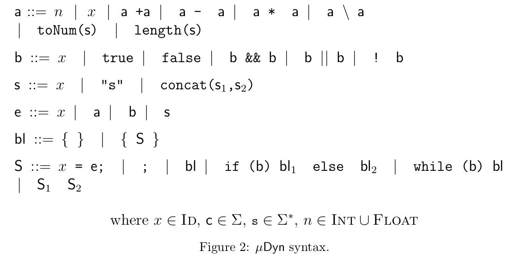

# MuDyn static analyzer (ICTAC 2019)
MuJS static analyzer is a static analyzer based on abstract interpretation for MuJs, a sub-language of JavaScript. Its syntax is reported in figure above.



## How to run the tool
```
git clone https://github.com/VincenzoArceri/mudyn-completeness
```
You can either build the Eclipse Proeject or run the  JAR file `mudyn.jar` as
```
java -jar mudyn.jar filename.js 
```
Some options are available:
* `-tajs`: set the TAJS string abstract domain (default)
* `-safe`: set the SAFE string abstract domain
* `-tajs-shell`: set the TAJS complete shell string abstract domain
* `-safe-shell`: set the SAFE complete shell string abstract domain
* `-tajs-comp `: performs the analysis with both the TAJS string domain and its complete shell (showing precision entropy information)
* `-safe-comp `: performs the analysis with both the SAFE string domain and its complete shell (showing precision entropy information)
* `-invariants `: prints the invariants for each program point. By default, it prints only the abstract state holding at the exit program point
* `-help`: print the menu.

## Example
Consider the following MuDyn program.

```
str = "24kobe8";
numbers = "";
notnumbers = "";
i = 0;
while (i < length(str)) {
	if (toNum(charAt(str, i)) == 0) {
		notnumbers = concat(notnumbers, charAt(str, i));
	} else {
		numbers = concat(numbers, charAt(str, i));	
	}

	i = i + 1;
}
```

The output of `java -jar -coalesced mudyn.jar file.js --tajs-comp` prints, for each prorgam point a table similar to the following (that is the table for the exit program point)

```
| Variable  | TAJS original domain| TAJS shell domain   | Precision increment|
|============================================================================|
| str       | "24kobe8"           | "24kobe8"           | -                  |
| notnumbers| String              | UnsignedOrNotNumeric| 1                  |
| numbers   | String              | UnsignedOrNotNumeric| 1                  |
| i         | UnsignedInt         | UnsignedInt         | -                  |

```
## Contributors
- Vincenzo Arceri vincenzo.arceri@univr.it
- Martina Olliaro martina.olliaro@unive.it
- Tino Cortesi cortesi@unive.it
- Isabella Mastroeni isabella.mastroeni@univr.it
